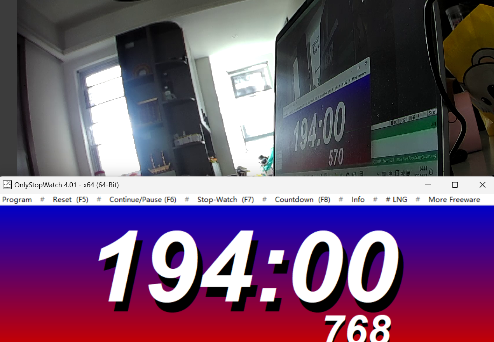
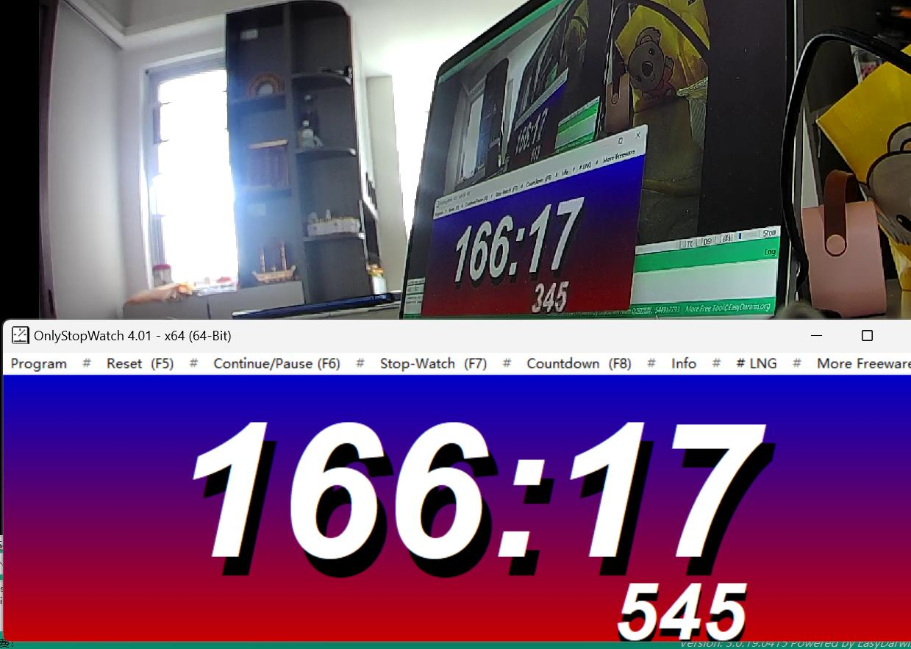

# rtsp延时测试:
测试视频按照1080P60,H264,CBR,4M

## 测试结果
1.sample_vio(hi3519dv500) -> rtspserver(hi3519dv500) -> easyplay(pc) \
使用easyplay播放器播放，sample_vio low delay模式延时在180ms左右; \

2.sample_vio(3519dv500) -> rtspserver(3519dv500) -> rtspcli(x64) -> rtspserver(x64)-> easyplay(pc)
使用easyplay播放器播放，sample_vio low delay模式，x64-PC端使用rtspcli拉流,在通过rtspserver进行转发流测试 \
拉取rtspserver /live/pull.ch0下的流实际测试延时在200ms; \

3.sample_vio(3519dv500) -> rtspserver(3519dv500) -> rtspcli(3519dv500) \
通过打印时间戳的统计延时，在同一个hi3519dv500的测试板上跑rtspserver,rtspcli;rtspcli拉流延时在6-10ms

4.使用easyplay播放器播放，sample_venc 延时在280ms左右;vlc/ffmpeg在500-600ms左右 \

## 测试过程

### rtsp测试;rtspcli
hi35519dv500平台测试
sample_vio(3519dv500) -> rtspserver(3519dv500) -> rtspcli(3519dv500) \
通过打印时间戳的统计延时，在同一个hi3519dv500的测试板上跑rtspserver,rtspcli;rtspcli拉流延时在6-10ms \
[GetData2Send]rtsp:pts:9637224,utc:9634334,now:9634336,len:97578,cos:2ms
[GetData2Send]rtsp:pts:9638224,utc:9635334,now:9635336,len:97042,cos:2ms
[GetData2Send]rtsp:pts:9639224,utc:9636334,now:9636336,len:100095,cos:2ms
[GetData2Send]rtsp:pts:9640224,utc:9637334,now:9637336,len:101122,cos:2ms
[GetData2Send]rtsp:pts:9641224,utc:9638334,now:9638336,len:111716,cos:2ms
[GetData2Send]rtsp:pts:9642224,utc:9639334,now:9639336,len:115320,cos:2ms
[GetData2Send]rtsp:pts:9643224,utc:9640334,now:9640337,len:118678,cos:3ms
[GetData2Send]rtsp:pts:9644224,utc:9641334,now:9641337,len:122611,cos:3ms
[GetData2Send]rtsp:pts:9645224,utc:9642334,now:9642337,len:121035,cos:3ms
[GetData2Send]rtsp:pts:9646224,utc:9643334,now:9643337,len:102230,cos:3ms

[RtpOnFrameIn]H264,time:4281012504,utc:9634339,len:97578,type:5,flags:0,wh:1920*1080
[RtpOnFrameIn]H264,time:4281103464,utc:9635352,len:97042,type:5,flags:0,wh:1920*1080
[RtpOnFrameIn]H264,time:4281194424,utc:9636339,len:100095,type:5,flags:0,wh:1920*1080
[RtpOnFrameIn]H264,time:4281285384,utc:9637339,len:101122,type:5,flags:0,wh:1920*1080
[RtpOnFrameIn]H264,time:4281376344,utc:9638382,len:111716,type:5,flags:0,wh:1920*1080
[RtpOnFrameIn]H264,time:4281467304,utc:9639391,len:115320,type:5,flags:0,wh:1920*1080
[RtpOnFrameIn]H264,time:4281558264,utc:9640341,len:118678,type:5,flags:0,wh:1920*1080
[RtpOnFrameIn]H264,time:4281649224,utc:9641340,len:122611,type:5,flags:0,wh:1920*1080
[RtpOnFrameIn]H264,time:4281740184,utc:9642340,len:121035,type:5,flags:0,wh:1920*1080
[RtpOnFrameIn]H264,time:4281831144,utc:9643340,len:102230,type:5,flags:0,wh:1920*1080

## 本地测试
writer不跨进程,本机rtspserver-rtspcli测试;
### 1.x86
1.rtsp_writer(rtsp+rtspserver)[read h264文件->shmfifo(不跨进程)->rtspserver]-->rtspcli[本机socket(192.168.1.166)]
通过utc时间戳可以看到 rtp 140K左右I帧耗时6-7ms
[GetData2Send]rtsp:pts:51320114,utc:51320114,len:56697,cos:0ms
[GetData2Send]rtsp:pts:51321112,utc:51321112,len:56656,cos:1ms
[GetData2Send]rtsp:pts:51322118,utc:51322118,len:56568,cos:0ms
[GetData2Send]rtsp:pts:51323110,utc:51323110,len:56152,cos:0ms
[GetData2Send]rtsp:pts:51324115,utc:51324115,len:65040,cos:0ms
[GetData2Send]rtsp:pts:51325119,utc:51325119,len:55746,cos:0ms
[GetData2Send]rtsp:pts:51326117,utc:51326117,len:56219,cos:0ms
[GetData2Send]rtsp:pts:51327110,utc:51327110,len:56858,cos:0ms

rtspcli取流
[_frameH264]H264,time:867553264,utc:51320115,len:56697,type:5,flags:0,wh:1920*1080,pkgcnt:4
[_frameH264]H264,time:867643484,utc:51321156,len:56656,type:5,flags:0,wh:1920*1080,pkgcnt:4
[_frameH264]H264,time:867734424,utc:51322119,len:56568,type:5,flags:0,wh:1920*1080,pkgcnt:4
[_frameH264]H264,time:867824104,utc:51323111,len:56152,type:5,flags:0,wh:1920*1080,pkgcnt:4
[_frameH264]H264,time:867914954,utc:51324116,len:65040,type:5,flags:0,wh:1920*1080,pkgcnt:4
[_frameH264]H264,time:868005714,utc:51325120,len:55746,type:5,flags:0,wh:1920*1080,pkgcnt:4
[_frameH264]H264,time:868095934,utc:51326117,len:56219,type:5,flags:0,wh:1920*1080,pkgcnt:4
[_frameH264]H264,time:868185704,utc:51327110,len:56858,type:5,flags:0,wh:1920*1080,pkgcnt:4

### 2.hi3519dv500
本机rtsp测试;writer不跨进程
1.rtsp_writer(rtsp+rtspserver)[read h264文件->shmfifo(不跨进程)->rtspserver]-->rtspcli[本机socket]
通过utc时间戳可以看到 rtp 140K左右I帧耗时6-7ms
[GetData2Send]rtsp:pts:1935090,utc:1935090,len:147212,cos:0ms
[GetData2Send]rtsp:pts:1937490,utc:1937490,len:157546,cos:0ms
[GetData2Send]rtsp:pts:1939890,utc:1939890,len:168416,cos:0ms
[GetData2Send]rtsp:pts:1942290,utc:1942290,len:123416,cos:0ms
[GetData2Send]rtsp:pts:1944690,utc:1944690,len:128437,cos:0ms
[GetData2Send]rtsp:pts:1947090,utc:1947090,len:120246,cos:0ms
[GetData2Send]rtsp:pts:1949490,utc:1949490,len:126019,cos:0ms
[GetData2Send]rtsp:pts:1951890,utc:1951890,len:130330,cos:0ms
[GetData2Send]rtsp:pts:1954290,utc:1954290,len:136267,cos:0ms
[GetData2Send]rtsp:pts:1956690,utc:1956690,len:135323,cos:0ms
[GetData2Send]rtsp:pts:1959090,utc:1959090,len:141243,cos:0ms
[GetData2Send]rtsp:pts:1961490,utc:1961490,len:156180,cos:0ms
[GetData2Send]rtsp:pts:1963890,utc:1963890,len:128671,cos:0ms
[GetData2Send]rtsp:pts:1966290,utc:1966290,len:144190,cos:0ms
[GetData2Send]rtsp:pts:1968690,utc:1968690,len:139124,cos:0ms
[GetData2Send]rtsp:pts:1971090,utc:1971090,len:143974,cos:0ms
[GetData2Send]rtsp:pts:1973490,utc:1973490,len:142918,cos:0ms
[GetData2Send]rtsp:pts:1975890,utc:1975890,len:147907,cos:0ms
[GetData2Send]rtsp:pts:1978290,utc:1978290,len:160805,cos:0ms

hi3519dv500-rtspcli[本机127.0.0.1socket通信,socket发送耗时6-7ms];
[不使用环回地址tcp192.168.1.66,当tcp缓冲区满之后，存在cli阻塞server端，存在耗时不稳定存在取帧超过1000-3000ms可能]
存在问题RTP时间戳不准确1s
[_frameH264]H264,time:3413773169,utc:1935140,len:147212,type:5,flags:0,wh:1920*1080
[_frameH264]H264,time:3413990129,utc:1937497,len:157546,type:5,flags:0,wh:1920*1080
[_frameH264]H264,time:3414207089,utc:1939897,len:168416,type:5,flags:0,wh:1920*1080
[_frameH264]H264,time:3414424049,utc:1942297,len:123416,type:5,flags:0,wh:1920*1080
[_frameH264]H264,time:3414641009,utc:1944696,len:128437,type:5,flags:0,wh:1920*1080
[_frameH264]H264,time:3414857969,utc:1947095,len:120246,type:5,flags:0,wh:1920*1080
[_frameH264]H264,time:3415074929,utc:1949495,len:126019,type:5,flags:0,wh:1920*1080
[_frameH264]H264,time:3415291889,utc:1951896,len:130330,type:5,flags:0,wh:1920*1080
[_frameH264]H264,time:3415508849,utc:1954296,len:136267,type:5,flags:0,wh:1920*1080
[_frameH264]H264,time:3415725809,utc:1956696,len:135323,type:5,flags:0,wh:1920*1080
[_frameH264]H264,time:3415942769,utc:1959098,len:141243,type:5,flags:0,wh:1920*1080
[_frameH264]H264,time:3416159729,utc:1961498,len:156180,type:5,flags:0,wh:1920*1080
[_frameH264]H264,time:3416376689,utc:1963895,len:128671,type:5,flags:0,wh:1920*1080
[_frameH264]H264,time:3416593649,utc:1966296,len:144190,type:5,flags:0,wh:1920*1080
[_frameH264]H264,time:3416810609,utc:1968696,len:139124,type:5,flags:0,wh:1920*1080
[_frameH264]H264,time:3417027569,utc:1971096,len:143974,type:5,flags:0,wh:1920*1080
[_frameH264]H264,time:3417244529,utc:1973496,len:142918,type:5,flags:0,wh:1920*1080
[_frameH264]H264,time:3417461489,utc:1975896,len:147907,type:5,flags:0,wh:1920*1080
[_frameH264]H264,time:3417678449,utc:1978297,len:160805,type:5,flags:0,wh:1920*1080

## [hi3519dv500]sample_venc测试 hi3519dv500-rtspcli[本机127.0.0.1socket通信,socket发送耗时6-7ms];
[GetData2Send]rtsp:pts:164551,utc:161680,now:161681,len:72761,cos:1ms
[GetData2Send]rtsp:pts:165584,utc:162713,now:162715,len:71499,cos:2ms
[GetData2Send]rtsp:pts:166618,utc:163746,now:163748,len:81814,cos:2ms
[GetData2Send]rtsp:pts:167634,utc:164764,now:164768,len:73419,cos:4ms
[GetData2Send]rtsp:pts:168684,utc:165813,now:165814,len:61426,cos:1ms
[GetData2Send]rtsp:pts:169718,utc:166846,now:166848,len:70242,cos:2ms
[GetData2Send]rtsp:pts:170734,utc:167863,now:167865,len:84255,cos:2ms
[GetData2Send]rtsp:pts:171768,utc:168898,now:168901,len:99341,cos:3ms
[GetData2Send]rtsp:pts:172818,utc:169948,now:169952,len:100339,cos:4ms
[GetData2Send]rtsp:pts:173834,utc:170963,now:170965,len:101858,cos:2ms
[GetData2Send]rtsp:pts:174868,utc:171998,now:172002,len:101896,cos:4ms
[GetData2Send]rtsp:pts:175901,utc:173030,now:173032,len:100991,cos:2ms
[GetData2Send]rtsp:pts:176935,utc:174065,now:174069,len:99215,cos:4ms
[GetData2Send]rtsp:pts:177968,utc:175097,now:175098,len:79663,cos:1ms
[GetData2Send]rtsp:pts:179001,utc:176130,now:176132,len:86907,cos:2ms
[GetData2Send]rtsp:pts:180035,utc:177164,now:177166,len:100399,cos:2ms
[GetData2Send]rtsp:pts:181085,utc:178213,now:178216,len:118968,cos:3ms
[GetData2Send]rtsp:pts:182135,utc:179374,now:179377,len:110618,cos:3ms

[_frameH264]H264,time:1073960648,utc:161687,len:72761,type:5,flags:0,wh:1920*1080
[_frameH264]H264,time:1074054578,utc:162720,len:71499,type:5,flags:0,wh:1920*1080
[_frameH264]H264,time:1074148598,utc:163754,len:81814,type:5,flags:0,wh:1920*1080
[_frameH264]H264,time:1074240998,utc:164774,len:73419,type:5,flags:0,wh:1920*1080
[_frameH264]H264,time:1074336458,utc:165822,len:61426,type:5,flags:0,wh:1920*1080
[_frameH264]H264,time:1074430478,utc:166902,len:70242,type:5,flags:0,wh:1920*1080
[_frameH264]H264,time:1074522878,utc:167872,len:84255,type:5,flags:0,wh:1920*1080
[_frameH264]H264,time:1074616898,utc:168908,len:99341,type:5,flags:0,wh:1920*1080
[_frameH264]H264,time:1074712358,utc:169959,len:100339,type:5,flags:0,wh:1920*1080
[_frameH264]H264,time:1074804758,utc:170974,len:101858,type:5,flags:0,wh:1920*1080
[_frameH264]H264,time:1074898778,utc:172008,len:101896,type:5,flags:0,wh:1920*1080
[_frameH264]H264,time:1074992708,utc:173038,len:100991,type:5,flags:0,wh:1920*1080
[_frameH264]H264,time:1075086728,utc:174076,len:99215,type:5,flags:0,wh:1920*1080
[_frameH264]H264,time:1075180658,utc:175152,len:79663,type:5,flags:0,wh:1920*1080
[_frameH264]H264,time:1075274588,utc:176140,len:86907,type:5,flags:0,wh:1920*1080
[_frameH264]H264,time:1075368608,utc:177174,len:100399,type:5,flags:0,wh:1920*1080
[_frameH264]H264,time:1075464068,utc:178225,len:118968,type:5,flags:0,wh:1920*1080
[_frameH264]H264,time:1075559528,utc:179384,len:110618,type:5,flags:0,wh:1920*1080
[_frameH264]H264,time:1075653458,utc:180411,len:102687,type:5,flags:0,wh:1920*1080

